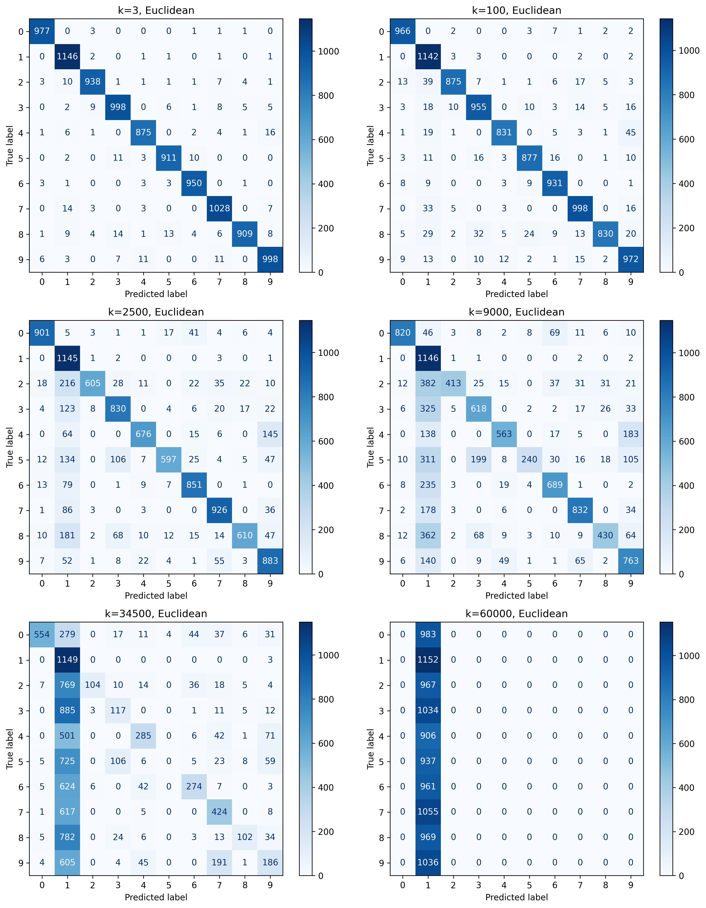
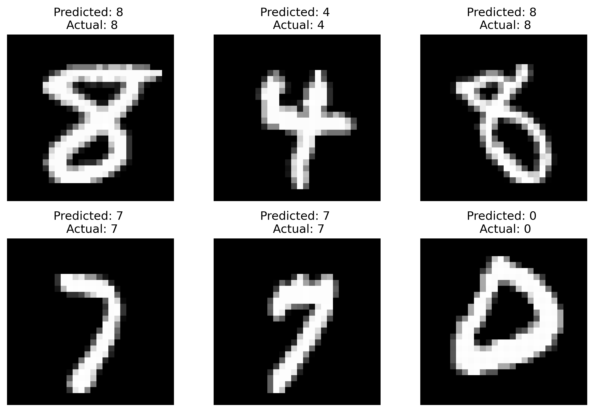
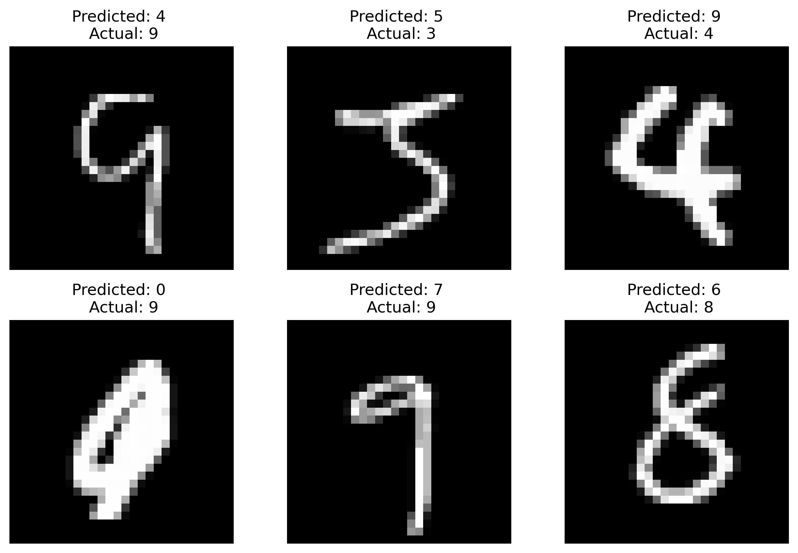

# MNIST Digit Classification: k-NN vs Nearest Centroid

This repository contains the implementation and analysis of two classic machine learning algorithms used to classify handwritten digits from the **MNIST dataset**: **K-Nearest Neighbors (k-NN)** and the **Nearest Centroid Classifier**.

## 📄 Full Project Report
For a deep dive into the methodology, mathematical background, and a detailed analysis of the misclassifications, please read the **[Full Project Report (PDF)](mnist_classifiers_report.pdf)**.

---

## 📊 Project Overview
The assignment focuses on building both custom and library-based (`scikit-learn`) versions of the classifiers to evaluate their generalization capabilities, performance, and behavior under different hyperparameters (distance metrics and number of neighbors $k$).

### 🧠 Algorithm Background (Theory)
<details>
<summary><b>1. K-Nearest Neighbors (k-NN)</b></summary>

The $k$-NN algorithm is a non-parametric method that predicts the class of a test sample based on the majority vote of its $k$ closest neighbors. 

We evaluated two distance metrics for feature vectors $x, y \in \mathbb{R}^{n}$:
* **Euclidean Distance:** $d(x,y)=\sqrt{\sum_{i=1}^{n}(x_{i}-y_{i})^{2}}$
* **Manhattan Distance:** $d(x,y)=\sum_{i=1}^{n}|x_{i}-y_{i}|$
</details>

<details>
<summary><b>2. Nearest Centroid Classifier</b></summary>

The Nearest Centroid classifier computes the target 'center' of each class during training and assigns an unknown sample to the class of the nearest centroid.
* **Euclidean Centroid (Mean):** $\mu_{c}=\frac{1}{|C_{c}|}\sum_{x\in C_{c}}x$
</details>

---

## 📈 Performance Summary

| Algorithm | Hyperparameters | Accuracy |
| :--- | :--- | :--- |
| **k-NN** (scikit-learn) | $k=3$, Euclidean | 97.11% |
| **k-NN** (Custom) | $k=3$, Euclidean | **97.30%** |
| **Nearest Centroid** (scikit-learn) | Euclidean | 81.30% |
| **Nearest Centroid** (Custom) | Euclidean | 81.30% |

### Key Insights:
* The **k-NN classifier** significantly outperforms the Nearest Centroid model by capturing local variations in handwriting styles.
* **Underfitting Effect:** Increasing $k$ leads to a massive drop in performance for k-NN, peaking at $k=60,000$ where the model completely underfits and predicts only the majority class (Digit '1').
* **Metric Comparison:** Euclidean distance systematically yielded better accuracy than Manhattan distance for this specific morphological task.

---

## 🖼️ Visual Results

### The Underfitting Phenomenon
*Confusion matrices for Euclidean k-NN showing the degradation of accuracy as $k$ increases from 3 to 60,000.*
<p align="center">
  
</p>

### Classification Examples
*Examples of successful classifications vs. ambiguous, poorly written digits that confused the models.*
<p align="center">
  
  
</p>

---

## 📁 Repository Structure
* `mnist_classifiers.ipynb`: The complete Google Colab / Jupyter Notebook with the source code.
* `mnist_classifiers_report.pdf`: The detailed academic report of the project.
* `images/`: Directory containing generated confusion matrices and classification examples.

## 🛠️ Requirements & Installation
To run the notebook locally, ensure you have the following Python libraries installed:
```bash
pip install numpy scikit-learn matplotlib
